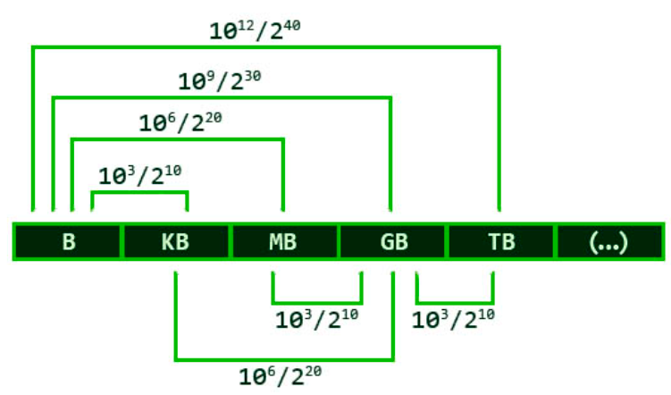

# Arquitetura de Computadores

## UNIDADES DE INFORMAÇÃO

TABELA: Valores em potências de 2 (binário) e de 10 (decimal):

| Unidade   | Valor em potência de 2 | Valor unitário     | Valor em potência de 10 | Valor unitário         |
|-----------|------------------------|---------------------|------------------------|------------------------|
| 1K(quilo) | 2^10                   | 1024                | 10^3                   | 1000                   |
| 1M(mega)  | 2^20                   | 1.048.576           | 10^6                   | 1.000.000              |
| 1G(giga)  | 2^30                   | 1.073.741.824       | 10^9                   | 1.000.000.000          |
| 1T(tera)  | 2^40                   | 1.099.511.627.776   | 10^12                  | 1.000.000.000.000      |

UNIDADES DE MEDIDA: Na base 2 e na base 10

* CONVERSÃO (Base 2): 

143 GB => KB ?

143 x 2^20 = 149.946.368 KB

* CONVERSÃO (Base 10): 

143 GB => KB ?

143 x 10^6 = 143.000.000 KB
