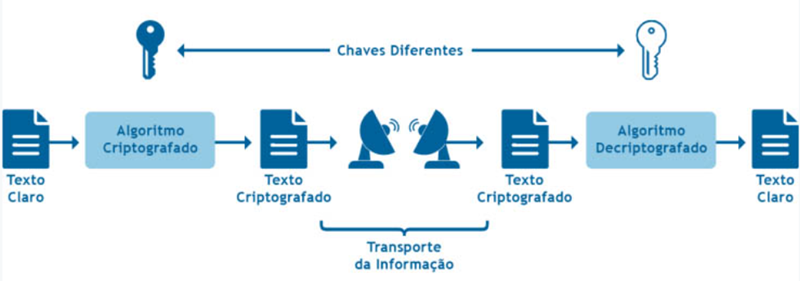

# Introdução à Segurança da Informação

## Os três principais aspectos da segurança da informação

* **Confidencialidade**

Capacidade do acesso à informação apenas para quem possui autorização.

* **Integridade**

Possibilidade de alteração da informação por pessoas ou sistemas autorizados.

* **Disponibilidade**

Faculdade de a informação poder ser acessada, em qualquer tempo, por pessoas ou sistemas autorizados para tal.

## Segurança Lógica (Criptografia)

* **Criptografia Simétrica**

Utiliza funções matemáticas mais simples e uma única chave para criptografar e decriptografar.

* **Criptografia Assimétrica**

Caracteriza-se por algoritmos que normalmente envolvem técnicas matemáticas mais sofisticadas, como a fatoração de números grandes e o logaritmo discreto. Esta família **emprega duas chaves**: uma é utilizada para cifrar; a outra, para decifrar. Tais chaves são conhecidas como: Pública e Privada.

