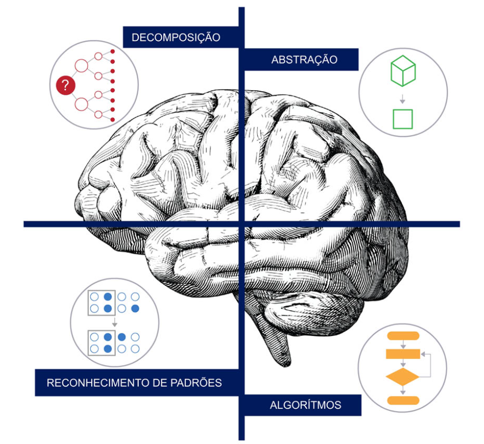

# Pensamento Computacional

## PILARES DO PENSAMENTO COMPUTACIONAL

- [x] DECOMPOSIÇÃO

A **decomposição** busca dividir um problema ou sistema complexo em partes menores, mais fáceis de compreender, gerenciar e resolver. Quando deixamos de olhar para um sistema como um todo e estudamos cada uma de suas peças menores, fica mais simples de compreender e buscar a solução desejada.

- [x] ABSTRAÇÃO

A **abstração** propõe ignorar detalhes irrelevantes para concentrar-se no que realmente importa. Não se preocupar com informações desnecessárias, além de economizar tempo, permite que possamos desenvolver a solução mais genérica possível.

- [x] RECONHECIMENTO DE PADRÕES

**Padrões** são semelhanças ou características que alguns dos problemas compartilham entre si. O **reconhecimento** dessas referências tem por objetivo aproveitar soluções já usadas no passado para lidar com uma nova dificuldade que seja suficientemente similar.

- [x] ALGORITMOS

Pilar fundamental do pensamento computacional é a automação por meio de **algoritmos**. Um algoritmo é uma série de instruções ou passos que são seguidos para resolver um problema ou realizar uma tarefa. No contexto da computação, um algoritmo é uma sequência de instruções que um computador pode seguir para realizar uma tarefa específica.