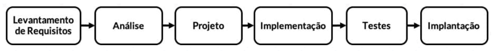

# Processos de Desenvolvimento de Software

## Atividades típicas de um Processo de Desenvolvimento de Software

* **Levantamento de Requisitos**

Nesta etapa, são identificados os requisitos que serão implementados no software projetado, além disso, é realizada a entrega do Documento de Requisitos contendo o escopo do projeto. O grande desafio é que o engenheiro de software tenha o mesmo entendimento do negócio que os usuários.

Tipos: Requisitos Funcionais, Requisitos Não-Funcionais e Requisitos de Domínio.